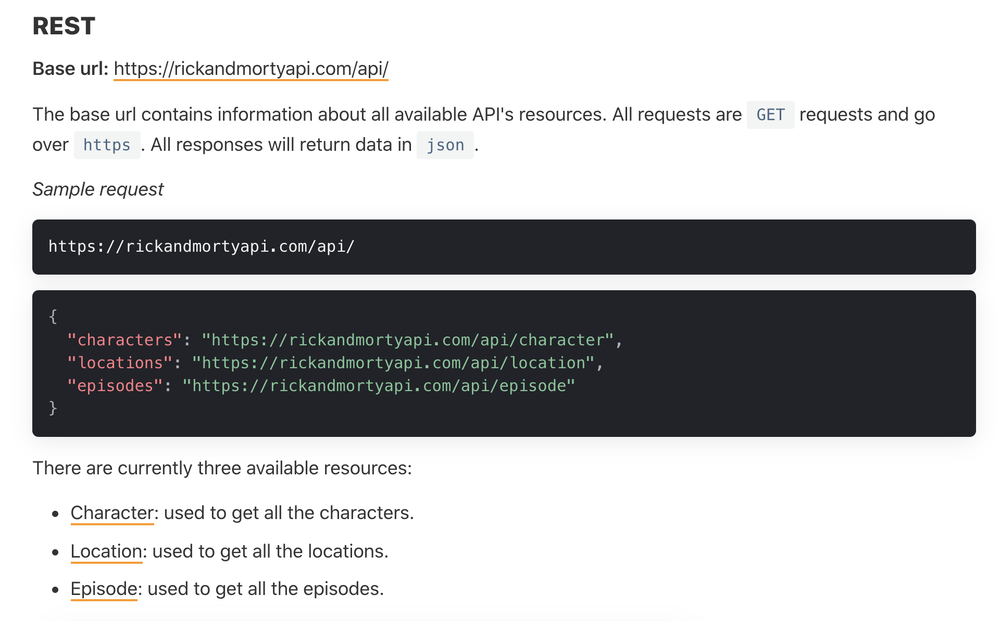
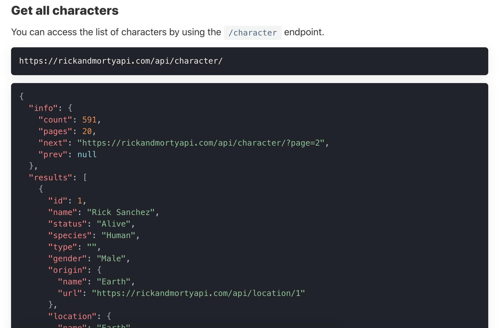
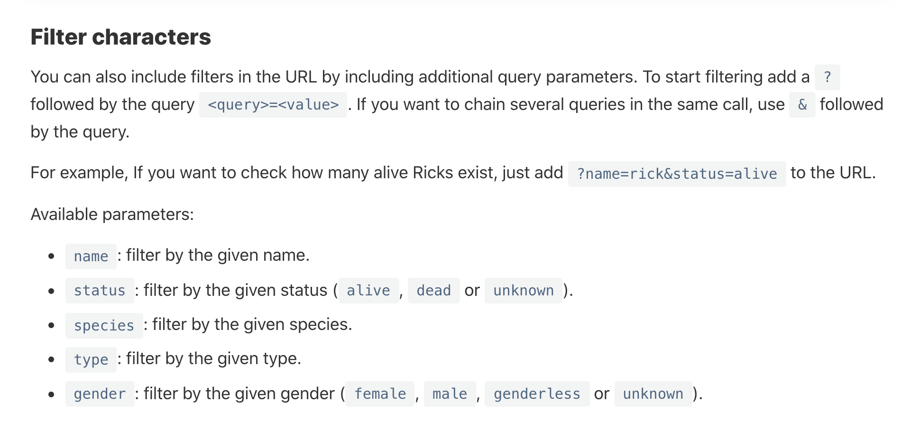
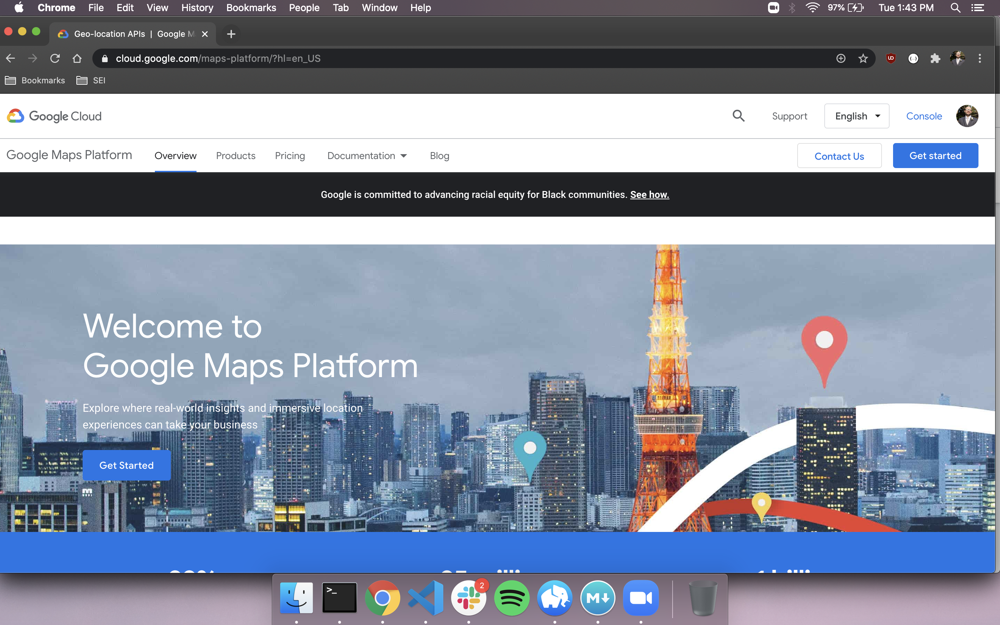
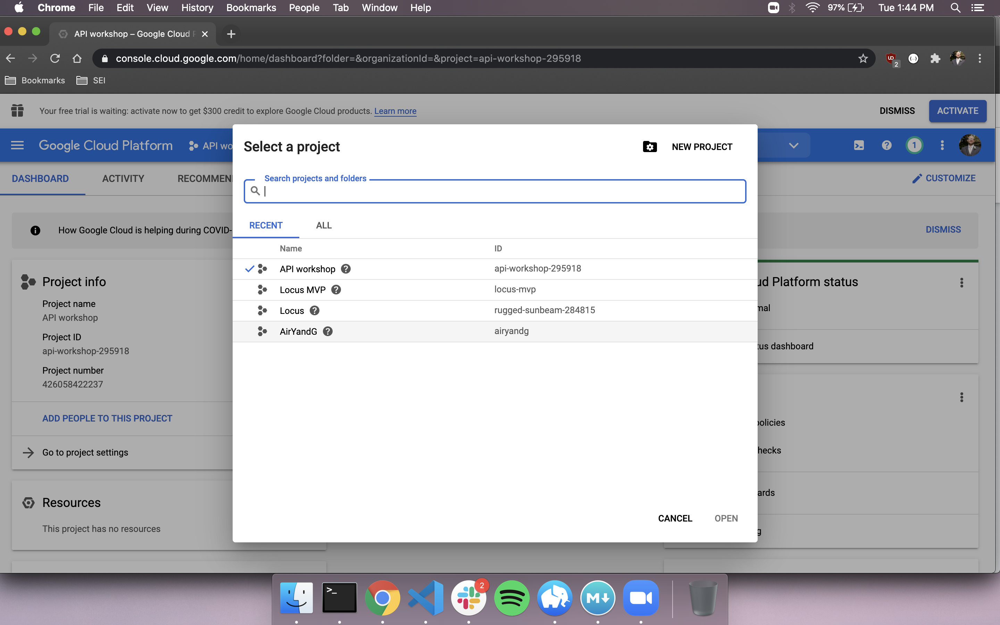
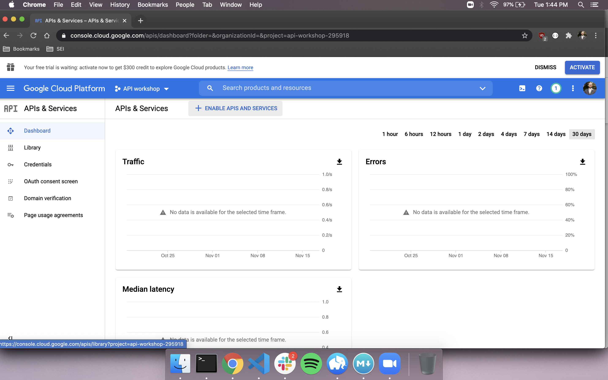
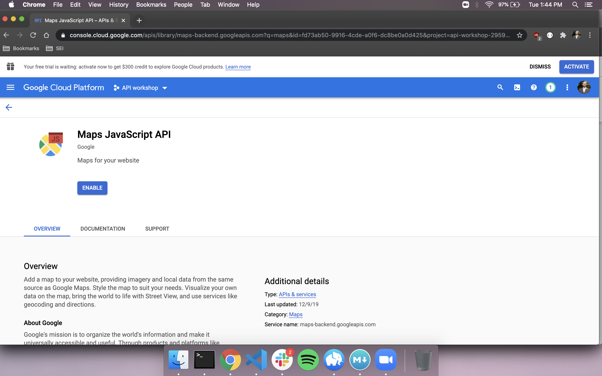
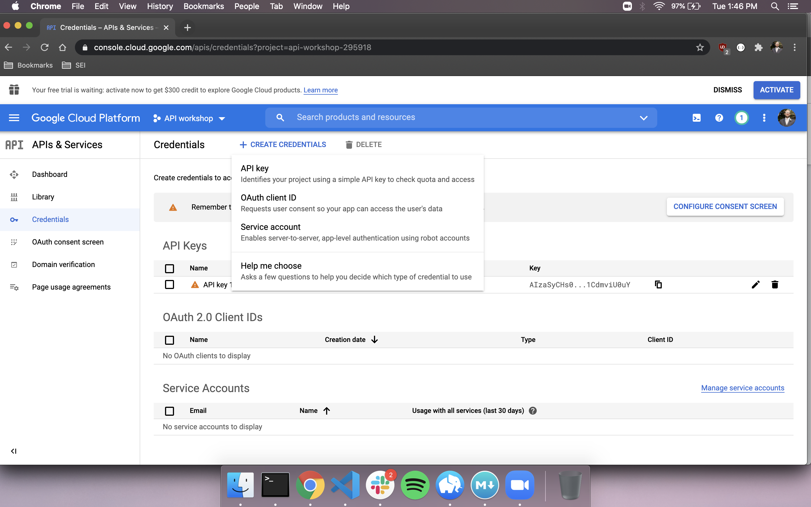

# Third Party APIs

## APIs

What is an API? API stands for Application Programming Interface. An API is a piece of software that defines how other components or systems can use it. The API defines the types of requests that can be made, how to make them, and the data formats that must be used. Typically, the APIs we use return lists of data when requested. Other APIs can provide other functionality, like Google Maps or Stripe.

### First Party APIs

First party APIs are APIs that are either built into the languages, frameworks, or browser. In-built APIs are things like the Web Audio API that Javascript can use to access audio in the browser. We can also call APIs that we have developed ourselves first party APIs.  Whenever you have built a back-end application that can be interacted with from a front-end, that is an API.

### Third Party APIs

Third Party Apis are APIs that are provided by com panies or individuals meant for public use. Many large companies like Facebook, Google, Twitter, and Paypal provide APIs for developers to use.  These APIs can be used to access those companies' data, like accessing tweets from twitter, or to provide use of those companies' functionalities, like Google Maps.

Some of these APIs will provide scripts to run on your page to gain access to their functionality.  Others will require you to make AJAX/HTTP calls to access their data. Let's look at some uses of this second kind.

## Making HTTP requests to APIs

When we want to use a third party api to get data, we start at the documentation.  Let's take a look at a simple API [here](https://rickandmortyapi.com/).  We can navigate to the docs portion of the site and learn how to format our requests to get data. We can find the url to send our requests to, the parameters to use, and queries that we can use to modify the data that comes back.

Here we can see some basic info about the api, including the base URL to send our requests to, as well as the different resources provided by the api.

Here we see information about a specific endpoints that we can request, as well as an example of the data coming back.

This tells us about some of the query parameters that we can include in our API request to specify the results that we want to receive.  Queries come at the end of our url, and a typical API call often looks like this:

	http://<someapiurl>/<endpoint>/?<query>=<value>&<otherquery>=<othervalue>
	
Now that we have an idea of how we can use this api, let's give it a try.

### Axios

There are many ways to make an API call, some of which are difficult, and some of which are easy to use.  My preferred method is by using Axios.

Axios is a popular JavaScript library you can use to perform HTTP requests.

You can link to the axios library in the head section of your HTML page with ``. Make sure to place the link to axios before the link to your main JS document or it won't work.

Once you have the Axios library in your code, you can do lots of wonderful customization to your API calls.  
[Axios documentation](https://www.npmjs.com/package/axios)
[Axios cheatsheet](https://kapeli.com/cheat_sheets/Axios.docset/Contents/Resources/Documents/index)

We'll be using axios today to make basic get requests.

## Authentication Methods

### No authentication

Some third party APIs are free to use and require no authentication. You can make requests to the API following their documentation without payment or authentication of any kind.  Most of these APIs have hourly, daily, or weekly limits on how many requests you can make.

### API keys

Many APIs require the use of API keys, which are strings of letters and numbers that can be used as a passcode.  This authenticates the user and allows requests to go through.  You still may have a timed limit, or may need to pay for the use of the API based on how many calls you make.

API keys are usually included in you calls in one of two ways: as a query parameter in your HTTP requests, or as an authorization header.  We can attach authorization headers with axios like this (or similarly):

	axios.get(url,   headers: {
    'Authorization': `{apiKey}` 
  	}
  	
### OAuth

OAuth is a multistage authentication protocol that involved the app obtaining an access token, and sending that token along with HTTP requests to the third party API.  Different APIs use different OAuth methods, and can have multiple tokens and protocols that provide different levels of access.

## Protecting your API keys

We should do all we can to protect our API keys.  Like any measure of security, nothing is fool-proof.  Implementing security measures is a trade-off: how skilled a thief are we trying to thwart? Do we need to stop the most skilled hackers, or are we just detering those looking for low-hanging fruit? It depends on how sensitive our data is, and how wide the audience for our app will be.

There are a few simple things we can do to protect ourselves.  Many APIs, especially those that charge money for their use, will have restrictions that we can set on our keys.  We'll see some of that in our Google Maps example.

The other thing we can do is to not upload our keys to github.  There are sophisticated ways to do this using environmental variables, but we won't talk ab out hose today.  Check out [dotenv](https://www.npmjs.com/package/dotenv) to explore this.

A simpler way to do this is to save our api key in a seperate JS file, and add that file to our .gitignore file. 

Let's run through that now.

## Using integrated APIs

As we mentioned above, some APIs can be scripted into your app.  You can link their API with the use of a `<script>` tag, and have access to methods and functionalities that the API provides.  One example of this is the Google Maps API.

First we need to visit the Google Cloud Platform.

We'll need to sign in or register.  You will have to enter a credit card to be able to use most apis.

Once that's done, you'll need to create a new project to connect your selected apis to.

From your dashboard, you can select 'Enable APIs and services to browse and search apis.

Once you've found the API you want to use, enable it from that APIs page.  Pay attention to whether this API involves billing!

After that, you can go to your credentials tab, where you can create credentials for each of the APIs you've selected. Make sure to restrict the key to your comfort.

Now it's time to read documentation! There are lots of great tutorials to follow along with, and thats a great place to start.  You can see what the API can do, and can run through the process before starting to customize it to your needs.  After that, you can read into the more technical portions of the docs to gain a better understanding of the features of the API.